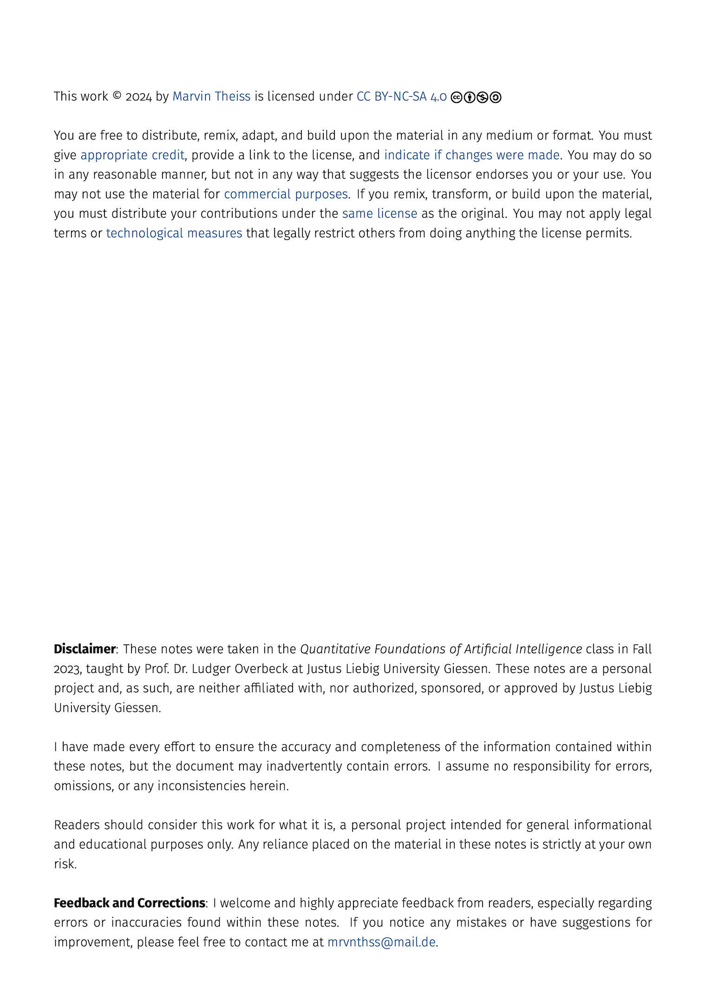

# Quantitative Foundations of AI

*Work in progress, check back soon.*

    
    

## Table of Contents

- [Disclaimer](#disclaimer)
- [Feedback and Corrections](#feedback-and-corrections)
- [License](#license)

## Disclaimer

These notes were taken in the *Quantitative Foundations of Artificial Intelligence* class in Fall 2023, taught by Prof. Dr. Ludger Overbeck at Justus Liebig University Giessen. These notes are a personal project and, as such, are neither affiliated with, nor authorized, sponsored, or approved by Justus Liebig University Giessen.

I have made every effort to ensure the accuracy and completeness of the information contained within these notes, but the document may inadvertently contain errors. I assume no responsibility for errors, omissions, or any inconsistencies herein.

Readers should consider this work for what it is, a personal project intended for general informational and educational purposes only. Any reliance placed on the material in these notes is strictly at your own risk.

## Feedback and Corrections

I welcome and highly appreciate feedback from readers, especially regarding errors or inaccuracies found within these notes. If you notice any mistakes or have suggestions for improvement, please feel free to contact me at [mrvnthss@mail.de](mailto:mrvnthss@mail.de?subject=[GitHub]%20Quantitative%20Foundations%20of%20Artificial%20Intelligence).

## License

This project is licensed under the [CC BY-NC-SA 4.0](https://creativecommons.org/licenses/by-nc-sa/4.0/) License - see the [LICENSE](LICENSE) file for details.

### You are free to:

- **Share** — copy and redistribute the material in any medium or format.

- **Adapt** — remix, transform, and build upon the material.

### Under the following terms:

- **Attribution** — You must give [appropriate credit](https://creativecommons.org/licenses/by-nc-sa/4.0/deed#ref-appropriate-credit), provide a link to the license, and [indicate if changes were made](https://creativecommons.org/licenses/by-nc-sa/4.0/deed#ref-indicate-changes). You may do so in any reasonable manner, but not in any way that suggests the licensor endorses you or your use.

- **NonCommercial** — You may not use the material for [commercial purposes](https://creativecommons.org/licenses/by-nc-sa/4.0/deed#ref-commercial-purposes).

- **ShareAlike** — If you remix, transform, or build upon the material, you must distribute your contributions under the [same license](https://creativecommons.org/licenses/by-nc-sa/4.0/deed#ref-same-license) as the original.

- **No additional restrictions** — You may not apply legal terms or [technological measures](https://creativecommons.org/licenses/by-nc-sa/4.0/deed#ref-technological-measures) that legally restrict others from doing anything the license permits.
